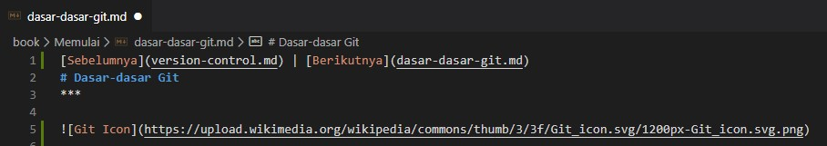

[Sebelumnya](version-control.md) | [Berikutnya](dasar-dasar-git.md)
# Dasar-dasar Git
***

**GIT** merupakan salah satu aplikasi *Version Control System* yang Git untuk melacak perubahan dalam *source code* selama pengembangan perangkat lunak. GIT dirancang agar programmer dapat saling bekerja sama, selain itu juga dapat digunakan untuk melacak perubahan dalam file apa pun. 

Ketika kamu melakukan perubahan pada file yang berada dalam repository git. Perubahan tersebut akan tercatat dalam **hidden folder** .git. Perubahan baik dari baris apa yang ditambahkan atau dikurangi, atau pun file mana yang baru ditambah dan dihapus. Ketika kamu menggunakan VSCode, ketika kamu melakukan penambahan akan terdapat garis hijau di pinggir text editor. Biru jika melakukan perubahan pada baris yang sebelumnya sudah disimpan, atau merah jika melakukan penghapusan pada baris.

Selain GIT terdapat beberapa aplikasi VCS lain yaitu diantaranya CVS, SVN, Mercurial dan Monotone, namun yang paling banyak digunakan adalah GIt. Kamu dapat melihat kelebihan dan kekurangan VCS lain di artikel ini [Version Control Software](https://www.softwaretestinghelp.com/version-control-software/). GIT dibuat oleh pembuat linux yaitu **Linus Torvalds**. Dia membuat GIT dikarenakan pada saat itu aplikasi VCS yang digunakan untuk mengembangkan linux tiba-tiba berbayar oleh karena itu Linus mencoba membuat tool VCS nya sendiri. Jika kamu ingin membaca sejarah tentang GIT dapat lihat pada link berikut [A History of GIT](https://git-scm.com/book/en/v2/Getting-Started-A-Short-History-of-Git).

[Sebelumnya](version-control.md) | [Berikutnya](dasar-dasar-git.md)